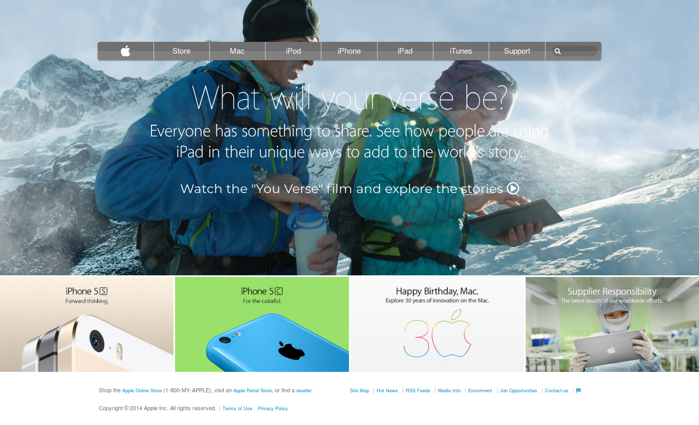

# Project: Building with Backgrounds and Gradients ([Old Apple website](https://web.archive.org/web/20140301004610/http://www.apple.com/))

This is the third project of the Main HTML/CSS curriculum at [Microverse](https://www.microverse.org/) - @microverseinc
* The goal was learn about setting up backgrounds using CSS3 gradients and images by redoing an old version of an apple webpage. 
* The project was completed using HTML and CSS.

#### [Assignment link](https://www.theodinproject.com/courses/html5-and-css3/lessons/building-with-backgrounds-and-gradients)

#### [View in broswer](https://raw.githack.com/codingAngarita/backgrounds-gradients/development/index.html)

#### Live ScreenShot of the page

#### Author

* [@codingAngarita](https://github.com/codingAngarita)
